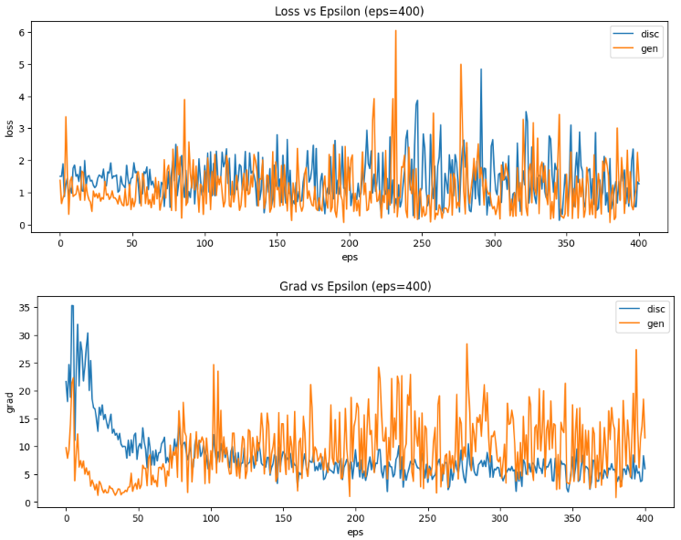
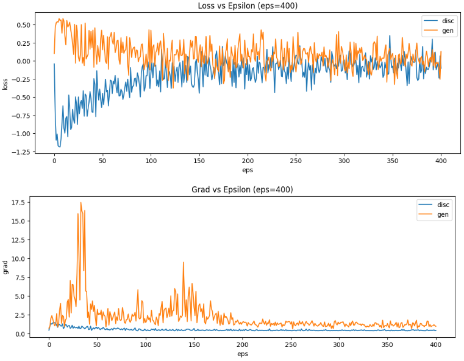
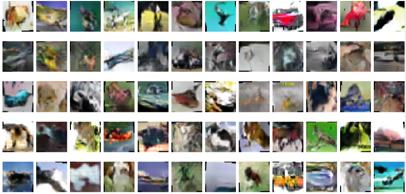
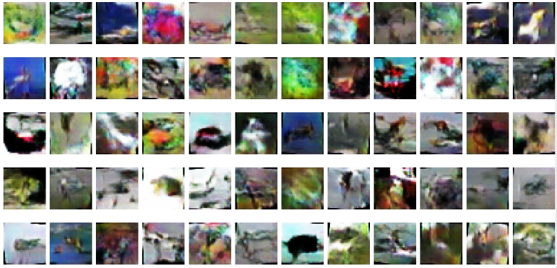
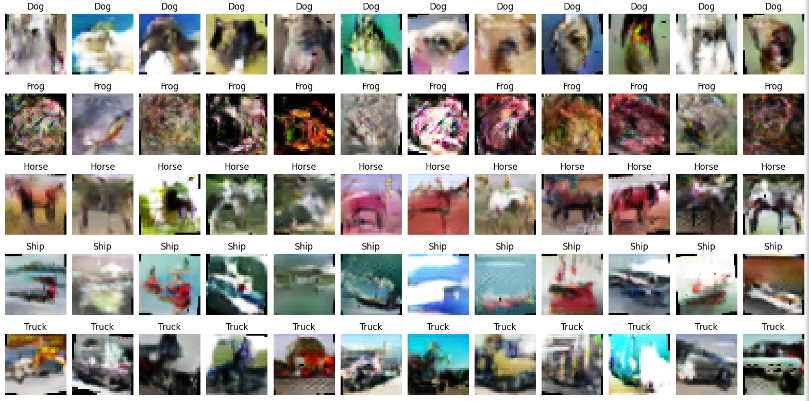
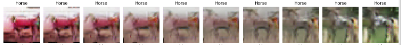
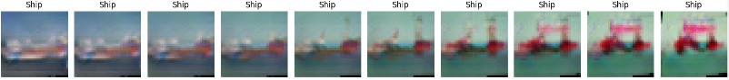
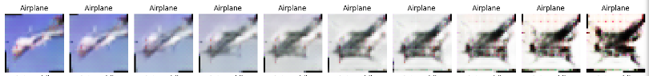
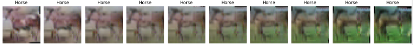

# GAN
Implementation of AC-GAN and WGAN. CIFAR-10 dataset is used.

## Results

### Training Process

#### Traditional GAN

#### WGAN

### Generated Images

#### Traditional GAN

#### WGAN

#### AC-GAN

### AC-GAN Latent Space Interpolations

